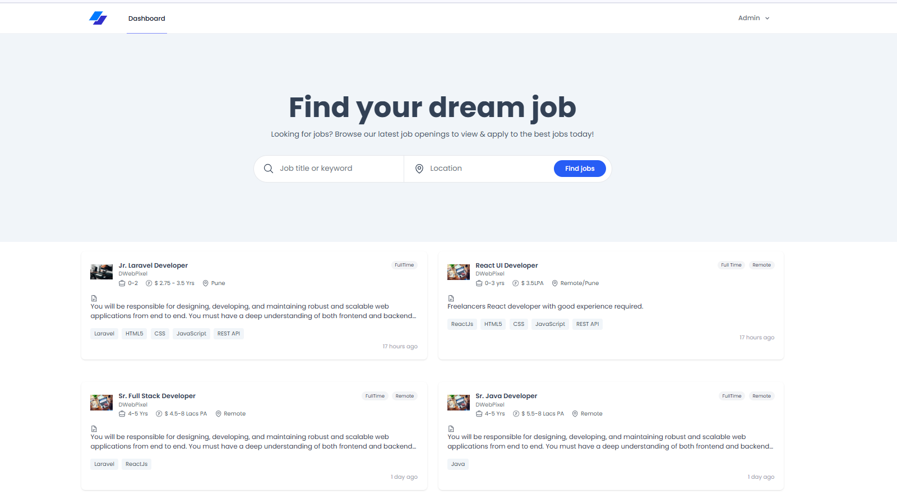
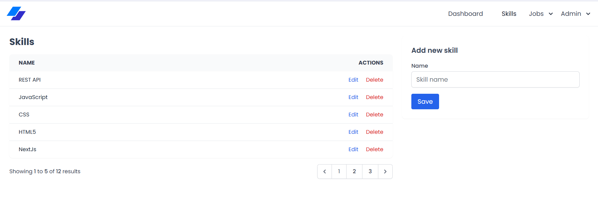
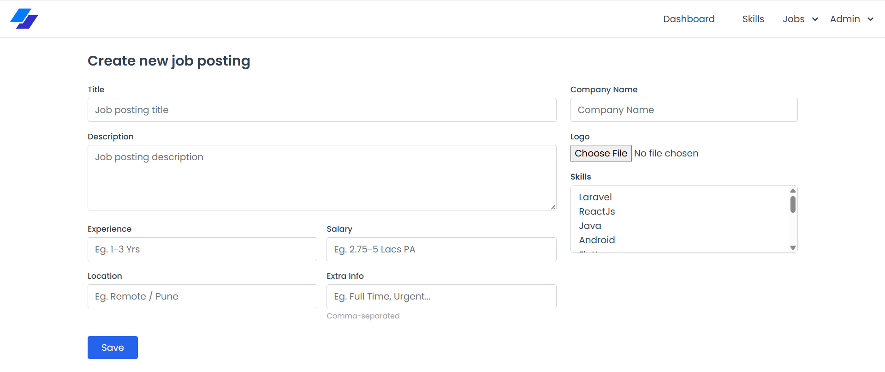
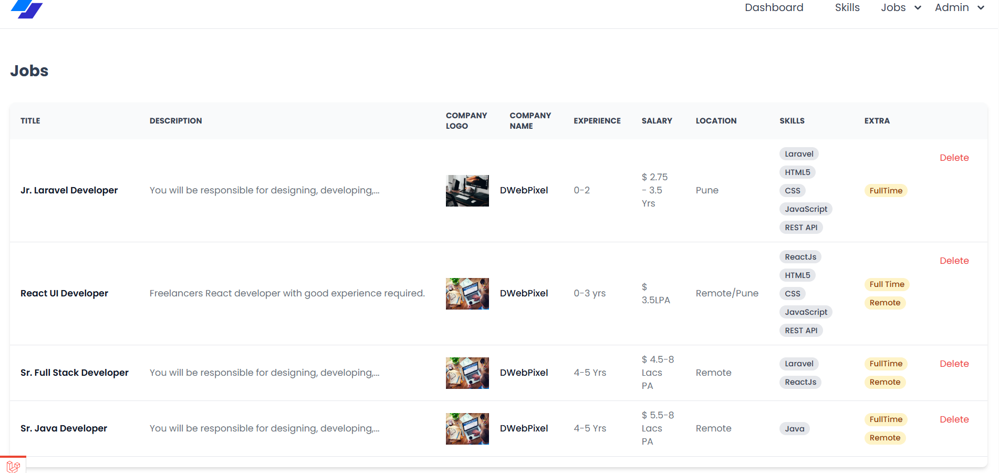

# 💼 Job Portal Web Application

This is a job portal web application that allows **administrators** to manage job postings and skills, and **users** to browse job listings via their dashboard. The app features role-based access control, a modern tech stack, and a responsive interface.

**Objective:**

The goal of this project is to develop a full-featured job portal with separate dashboards for **admins** and **users**. Admins can manage job postings and skills, while users can browse jobs presented in a visually appealing card format.


---

## 🧱 Technologies Used

### 👨‍💼 Admin Panel
- Laravel
- Livewire
- Alpine.js
- Tailwind CSS

### 👨‍💻 User Panel
- Laravel
- Inertia.js
- Vue.js
- Tailwind CSS

---

## 🔐 Authentication

Authentication is already implemented and functional using Laravel Breeze.  
The application supports **Role-Based Access Control** for Admin and User roles.

- **Admin Login**
  - Email: `admin@example.com`
  - Password: `password`

- **User Login**
  - Email: `user@example.com`
- ✅ Dynamic display with company logo and tag badges.
- ✅ Delete functionality for each job posting.

----

## 📸 Screenshots

### 🧭 Admin Dashboard


### 📝 Skill


### 📝 Job Posting Form


### 🧾 Job Card (User View)


---

### 🔹 User Dashboard

#### 🧾 Job Card UI
- ✅ Displays job title, description snippet, company logo, skills, and tags.
- ✅ Uses reusable components and icons (provided in the project).
- ✅ Jobs are dynamically fetched from the database.

---

## 📁 Project Setup Instructions

```bash
# 1. Clone the repository
git clone https://github.com/rinkalrv/laravel-dev-assessment.git                            
cd laravel-dev-assessment

# 2. Install PHP dependencies
composer install

# 3. Install Node dependencies
npm install && npm run dev

# 4. Copy .env and set up database
cp .env.example .env
php artisan key:generate

# 5. Migrate and seed database
php artisan migrate --seed

# 6. Link storage for logo uploads
php artisan storage:link

# 7. Run the application
php artisan serve

```
----

## ✅ Completed Features

### 🔹 Admin Dashboard

#### 🛠 Skills Management Page
- ✅ Displays a paginated table of skills.
- ✅ Includes a form to add new skills to the database.
- ✅ Skills are dynamically managed using Livewire.

#### 📄 Job Postings Management Page
- ✅ Form to create new job postings.
- ✅ Fields: Title, Description, Experience, Salary, Location, Company Name, Logo, Skills (multi), Extra Tags (comma-separated).
- ✅ `skills` and `extra` are stored as JSON arrays.
- ✅ Paginated list of job postings.